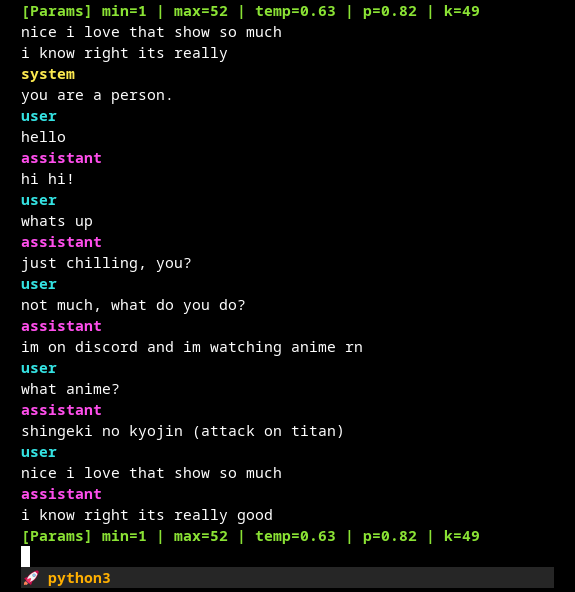

# Discord-Micae Model Chat Interface

A Python-based interactive CLI interface for chatting with Hugging Face transformer, optimized for casual, Discord-style conversation using ChatML.
Supports both quantized and full-precision models, optional Chain-of-Thought (CoT) context, live token streaming with color formatting, and dynamic generation parameter adjustment.

---



---

## Features

-   **Multiple Model Formats**

    -   Hugging Face Transformers (`AutoModelForCausalLM`)
    -   GGUF (llama.cpp) backend
    -   LoRA adapter loading
    -   4-bit / 8-bit quantization with bitsandbytes

-   **Custom Prompt Controls**

    -   Chain-of-Thought context management
    -   Raw blank mode, no system prompts, or assistant-only modes
    -   DeepHermes and ChatML formatting options
    -   Optional code detection and filtering

-   **Interactive Chat**

    -   Multi-line input with `prompt_toolkit`
    -   Persistent conversation history (`/back`, `/clear`)
    -   Runtime parameter adjustment (`/min`, `/max`, `/temp`, `/p`, `/k`)

-   **Streaming Output**
    -   Token-by-token display with **Rich** coloring
    -   Emoji filtering and cleanup
    -   Automatic lowercasing rules

---

## Installation

```
pip install torch transformers peft bitsandbytes prompt_toolkit rich
```

If using GGUF (llama.cpp models):

```
pip install llama-cpp-python
```

---

## CLI Arguments (with defaults)

```
usage: interface.py [-h] [-c] [-m MODEL]
                    [--deephermes] [--gguf] [--gguf-chat-format FORMAT]
                    [--blank] [--assistant-system-combo] [--assistant-system]
                    [--just-system-prompt] [--no-system-prompt]
                    [--no-assistant-prompt] [--code-check]
                    [--quantization] [--bnb-4bit] [--bnb-8bit]
                    [--custom-tokens]

optional arguments:
  -h, --help                Show this help message and exit
  -c, --cot                 Disable chain-of-thought message context (default: enabled)
  -m MODEL, --model MODEL   Model path or Hugging Face repo ID
                            (default: mookiezi/Discord-Micae-8B-Preview)

Feature toggles (defaults in parentheses):
  --deephermes               Enable DeepHermes formatting instead of ChatML (False)
  --gguf                     Use GGUF model format (llama.cpp backend) (False)
  --gguf-chat-format FORMAT  Chat format for GGUF models (chatml)
  --blank                    Use only raw user input (no prompts/system context) (False)
  --assistant-system-combo   Include both system and assistant system prompts (False)
  --assistant-system         Use assistant system prompt instead of standard (False)
  --just-system-prompt       Use only the system prompt with user input (False)
  --no-system-prompt         Do not include system prompt (False)
  --no-assistant-prompt      Do not include assistant prompt (False)
  --code-check               Enable code detection and filtering via classifier (False)
  --quantization             Enable bitsandbytes quantization (True)
  --bnb-4bit                 Load model in 4-bit mode (True)
  --bnb-8bit                 Load model in 8-bit mode (False)
  --custom-tokens            Add extra special tokens to tokenizer (False)
```

---

## Commands

| Command                | Description                        |
| ---------------------- | ---------------------------------- |
| `/clear` `/reset` `/c` | Clear conversation history         |
| `/back` `/b`           | Undo last exchange                 |
| `/h VAL`               | Enable CoT with last _VAL_ exchanges |
| `/d`                   | Disable CoT                        |
| `/min VAL`             | Set min_new_tokens to _VAL_        |
| `/max VAL`             | Set max_new_tokens to _VAL_        |
| `/temp` or `/t VAL`    | Set temperature to _VAL_           |
| `/p VAL`               | Set top_p to _VAL_                 |
| `/k VAL`               | Set top_k to _VAL_                 |
| `/params`              | Show current generation parameters |

---

## License

MIT License
